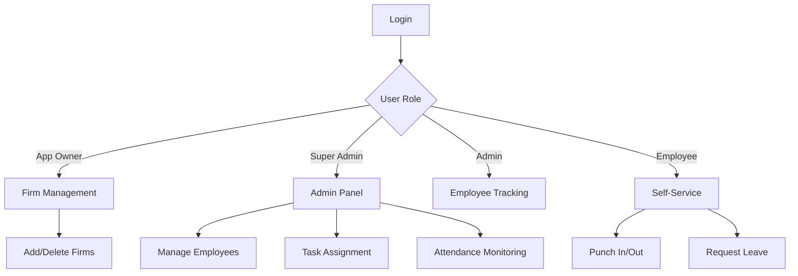

# File Management System - Project Documentation

## Table of Contents
1. [Introduction](#introduction)
2. [System Overview](#system-overview)
3. [User Roles & Access Control](#user-roles--access-control)
4. [Application Flow](#application-flow)
5. [Modules & Features](#modules--features)
6. [Technologies Used](#technologies-used)
7. [Security Considerations](#security-considerations)
8. [Future Enhancements](#future-enhancements)
9. [Project Setup Guide](#Project-Setup-Guide).

## Introduction
The **File Management System** is a comprehensive solution designed to manage firms, employees, tasks, attendance, expenses, and work centers with geofencing capabilities. The system provides role-based access control with four interfaces:
- App Owner
- Super Admin
- Admin
- Employee

The application uses Firebase Authentication (Phone OTP) for secure login and Firestore Database for real-time data storage. Google Maps API is integrated for geofencing and work center management.

## System Overview
### Key Components:
The system is divided into three major components:
1. **Authentication System** - Use phone OTP based login, and Handles registration, login, and role assignment.
2. **Role Management** - Hierarchical access control
3. **Core Features**: Includes firm management, employee tracking, task assignment, attendance, expenses, and geofencing.
   - Firm management
   - Employee tracking
   - Task assignment
   - Attendance with geofencing
   - Expense management
4. **Communication** - Provides in-app chat system, includes chat functionality and request approvals (leave, expenses, regularization).

## User Roles & Access Control

### App Owner
- Add/delete/update firms.
- Full administrative control over the system.

### Super Admin
- Define working hours and holidays (regular & public festivals).
- Add/remove employees/admins with custom permissions.
- Assign tasks to employees.
- Monitor attendance, expenses, and task statuses.
- Create work centers (manually or via Google Maps with geofencing).
- Chat with employees/admins.
- Approve/reject regularization requests (leave, expenses, advances).

### Admin
- All functionalities of an Employee.
- Track employee activities (attendance, tasks, expenses).
- Approve/reject employee requests.

### Employee
- Punch in/out with location tracking.
- Request leaves, advances, and expense approvals.
- View assigned tasks and submit remarks.
- Chat with admins/super admins.

## Application Flow


### A. Authentication Flow
1. User enters phone number → Firebase OTP verification.
2. New users register with firm details.
3. Role-based dashboard loads after login.

### B. Employee Flow
1. Punch In/Out:
    - First click detects location → Second click records attendance.
    - Can request additional work time.

2. Leave/Advance Requests:

    - Submitted to admin/super admin for approval.

3. Task Management:

    - View assigned tasks → Submit remarks.

### C. Super Admin & Admin Flow
1. Employee Management:

    - Add/update employees with custom permissions.

2. Task Assignment:

    - Assign tasks to one/multiple/all employees.

3. Attendance & Expense Tracking:

    - Filter by date/month.
4. Work Center Management:

    - Manually add or via Google Maps (geofencing enabled).

#### D. App Owner Flow
  - Add/delete firms and manage organizational structure.

## Modules & Features
### A. Authentication Module
  - Technology: Firebase Phone OTP Auth

  - Purpose: Secure login and role-based access.

### B. Firm Management Module
  - Features:

      - Add/delete firms (App Owner).

      - Assign employees to firms (Super Admin).

### C. Employee & Admin Management Module
  - Features:

    - Add employees/admins with custom permissions.

    - Set salary, leave days, and work hours.
   
### D. Task Management Module
  - Features:

    - Assign tasks to employees.

    - Track task status (Pending/Completed).

    - Add remarks.

### E. Attendance & Leave Module
  - Features:

    - Punch in/out with location tracking.

    - Leave requests (with approval workflow).

    - Attendance regularization.

### F. Expense & Advance Module
  - Features:

    - Raise money requests.

    - Track expense history (filter by date/month).

### G. Work Center & Geofencing Module
  - Technology: Google Maps API

  - Features:

    - Add work centers manually or via map.

    - Geofencing to monitor employee entry/exit.

### H. Chat Module
  - Features:

    - Real-time messaging between employees and admins.

### I. Regularization & Approvals Module
  - Features:

    - Approve/reject leave, expenses, and advances.
   
## Technologies Used

| Category            | Technology                | Purpose                                                                 |
|---------------------|---------------------------|-------------------------------------------------------------------------|
| Authentication      | Firebase Phone OTP        | Secure phone-based user authentication                                 |
| Database            | Cloud Firestore           | NoSQL real-time database for all application data                      |
| Local Storage       | Room Database             | Persistent local storage for auth tokens and user data                 |  
| Location Services   | Google Maps API           | Interactive maps and location services                                 |
| Geofencing          | Geofencing API            | Creating and monitoring geographical boundaries                        |
| Frontend Framework  | Jetpack Compose           | Cross-platform mobile application development                          |

## Security Considerations
  - Firebase Auth ensures secure authentication.

  - Role-based access prevents unauthorized actions.

  - Geofencing ensures attendance is location-based.

# Project Setup Guide
## Prerequisites

### Development Environment
- **Android Studio** (Latest Stable Version)
- **JDK** 17 or higher
- **Android SDK** (API Level 24+ recommended)
- **Kotlin** 1.8.20 or higher
### Dependencies
Add these to your `build.gradle` (Module: app):
  - Android core
  - Jetpack Compose
  - Firebase
  - Maps & Location
  - Room
  - Kotlin coroutine
  - Accompanist
  - libphonenumber
  - Work Manager
  - Extended Icons
### Adding Google Maps SDK & API Key

Your app requires the **Google Maps SDK** and an API key to function correctly. Follow these steps to set it up:

#### 1. Enable Google Maps SDK  
- Go to [Google Cloud Console](https://console.cloud.google.com/)
- Create a new project or select an existing one.
- Navigate to **APIs & Services** → **Library**.
- Search for **Maps SDK for Android** and **Geocoding API**.
- Click **Enable** for each required API.

#### 2. Get an API Key  
- In **APIs & Services** → **Credentials**, click **Create Credentials** → **API Key**.
- Copy the generated API key.

#### 3. Add API Key to Your Project  

In your `AndroidManifest.xml`, add:

```xml
<meta-data
    android:name="com.google.android.geo.API_KEY"
    android:value="YOUR_API_KEY_HERE" />
```

